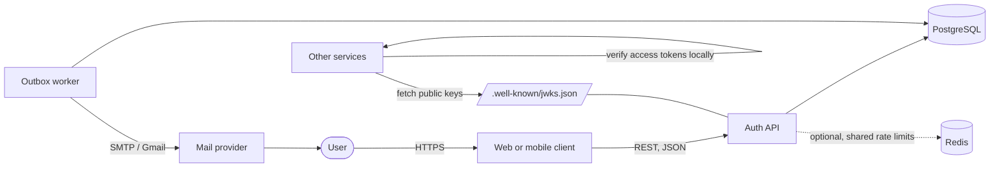
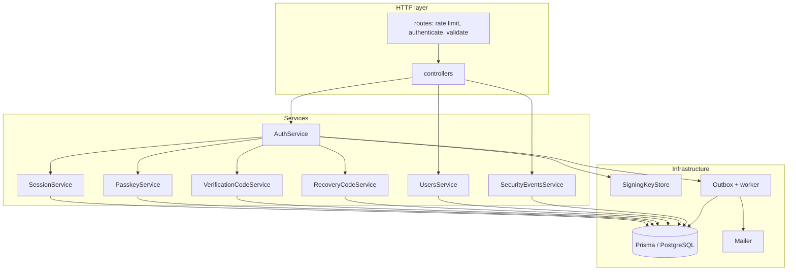
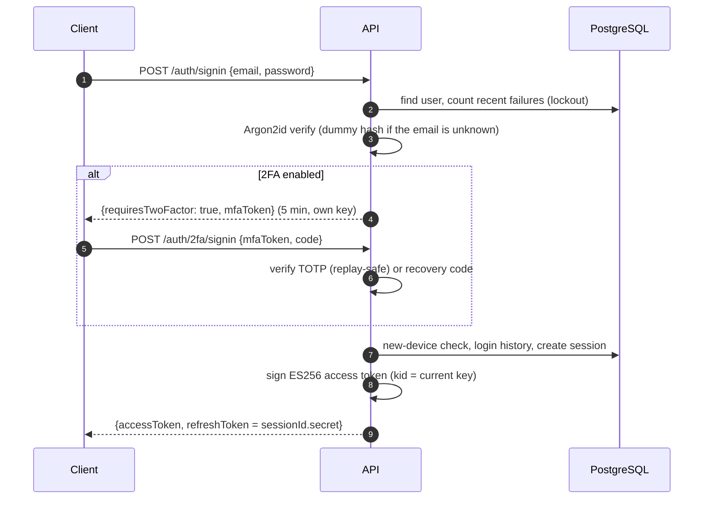
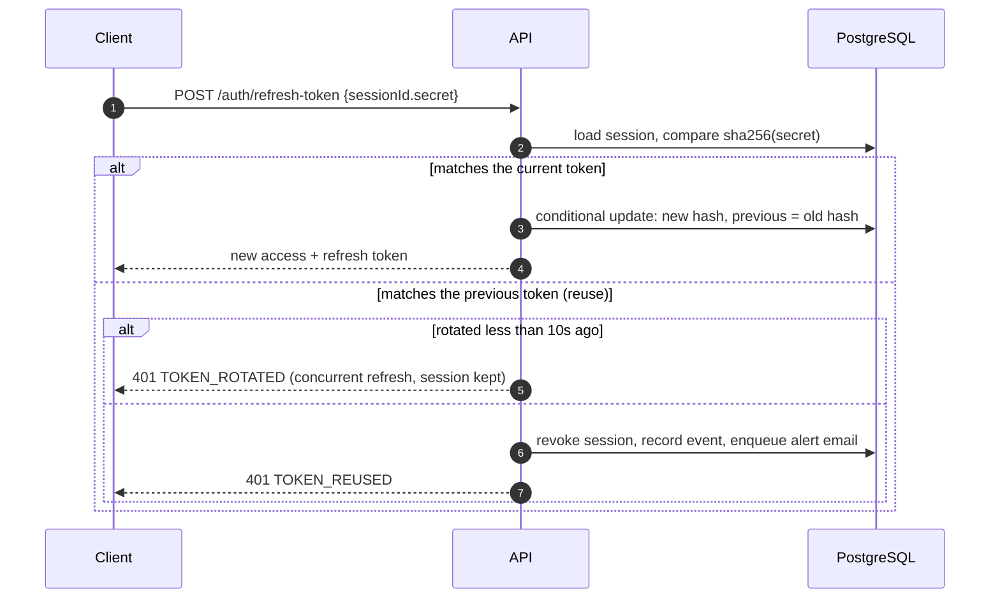
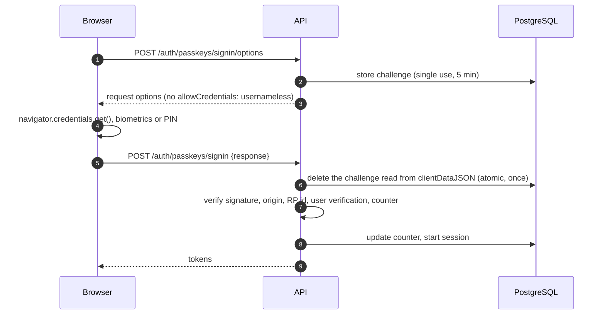
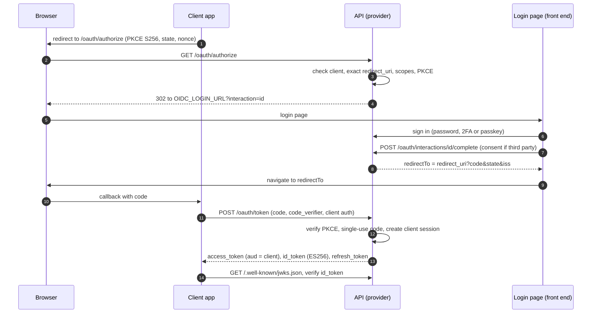
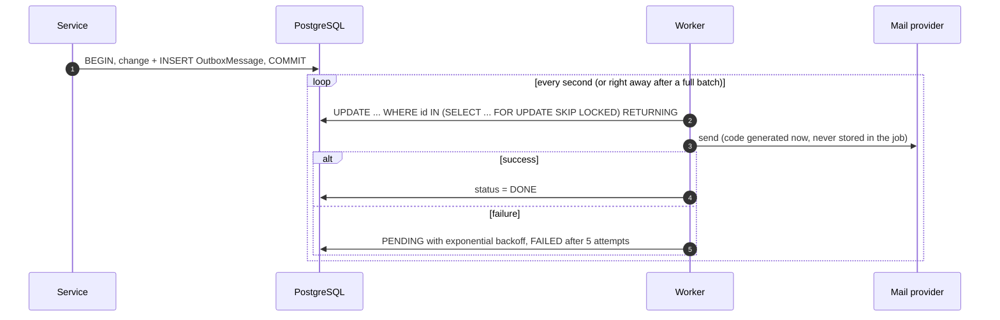
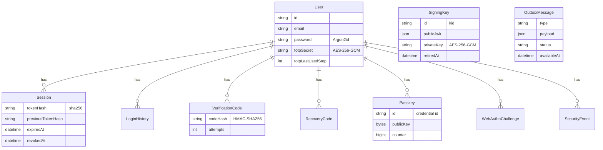

# Architecture

This document describes how the service is put together and how its main flows work. The reasoning behind the bigger choices is recorded in the [architecture decision records](adr/README.md), and the security analysis is in the [threat model](threat-model.md).

## System context

- **Auth API**: Express 5 application. Stateless apart from its database: any number of instances can run behind a load balancer.
- **Outbox worker**: delivers background jobs (emails). Runs inside each API process by default, or as separate processes.
- **PostgreSQL**: the only required infrastructure. Holds users, sessions, codes, keys, the outbox and the activity log.
- **Redis**: optional, only to share rate limit counters between instances.
- **Other services** verify access tokens with the public keys from the JWKS endpoint, without sharing any secret.
- **Client applications** can sign their users in through the OpenID Connect endpoints.

## Code layout

Rules that hold the structure together:

- **Controllers only translate HTTP.** They read the validated request, call one service method and shape the response. Express 5 forwards rejected promises, so there is no try/catch.
- **Services don't know about Express.** They take typed inputs (inferred from the Zod schemas), get dependencies through their constructor and throw `AppError`s with stable codes.
- **Composition happens in one place.** `buildApplication()` in `src/app.ts` wires every module; tests call it with an in-memory mailer.
- **Side effects go through the outbox**, written in the same transaction as the change that causes them.

## Main flows

### Sign in with a password and 2FA

### Refresh token rotation

### Passkey sign-in

### OpenID Connect sign-in for another application

### Outbox delivery

## Data model

`SigningKey` and `OutboxMessage` are not tied to a user.

## Keys and secrets

One secret, `ENCRYPTION_KEY`, protects everything stored at rest. Purpose-specific keys are derived from it with HKDF, so they are independent of each other:

| Derived key | Used for |
| --- | --- |
| `verification-code` | HMAC of email codes |
| `recovery-code` | HMAC of 2FA recovery codes |
| `totp-secret` | AES-256-GCM encryption of TOTP secrets |
| `signing-key` | AES-256-GCM encryption of the ES256 private keys |
| `mfa-token` | HS256 signature of the short-lived 2FA challenge token |

Refresh tokens are 256-bit random values, so a plain SHA-256 is enough to store them. Access tokens are signed with the ES256 key pairs in `SigningKey`, rotated automatically.

## Scaling

- API instances share nothing but PostgreSQL (and Redis for rate limits if configured).
- Signing keys: each instance caches the key set and reloads when it sees an unknown key id; rotation is serialized with a Postgres advisory lock.
- Outbox workers claim jobs with `FOR UPDATE SKIP LOCKED`, so they can be scaled out independently (`OUTBOX_WORKER_ENABLED=false` on the API plus `node dist/scripts/worker.js`).
- Every authenticated request does one primary-key lookup to check the session is still active. That is what makes revocation immediate; see [ADR 0002](adr/0002-server-side-sessions-and-rotating-refresh-tokens.md).
